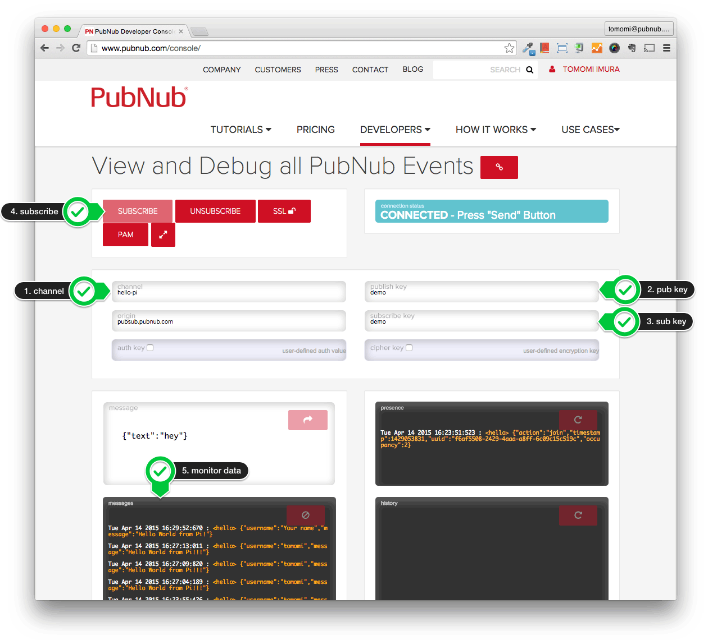

# IoT Hands On: Build a Realtime App with Raspberry Pi 2 and PubNub

Step-by-step guide of building a realtime Internet of Things application using sensor data from Raspberry Pi 2. Just released, this hardware makes it quick and easy to build and deploy internet-enabled sensors. You'll also learn how to aggregate that sensor data and display it with realtime updates over the PubNub network.

---

## Setting up Raspberry Pi

Skip the Step 0 and go to Step 1, if you have a preloaded SD Card from CanaKit or elsewhere.

### 0. Formatting an SD Card

The following steps are done on your computer.

1. Download [SD Formatter 4.0](https://www.sdcard.org/downloads/formatter_4) and install on your computer
2. Insert it in SD card reader to the computer. If you need, use a Micro SD adapter (photo).

3. Run SD Card Formatter

4. Download **Noobs** zip file from [raspberrypi.org](http://www.raspberrypi.org/downloads/) and extract.
5. Open up the drive, and drag-drop the unzipped **Noobs** contents (not the entire folder!) you just downloaded into the SD card. Then remove the SD card.

### 1. Installing Raspbian on Raspberry Pi

From now on you are working directly on your Raspberry Pi.

1. Insert the formatted SD card in Pi
2. Plug in your USB keyboard, USB mouse, and HDMI monitor cables
3. Plug in your Wi-Fi adapter
4. Plug a USB power, and turn your Pi on

(Maybe adding a nice photo of Pi with everything attatched here)

After connected to a monitor:

1. Your Raspberry Pi will boot, and a window will appear with a list of operating systems that you can install. Select **Raspbian** by ticking the box next to Raspbian and click on Install.
2. Raspbian will run through its installation process. Just wait.
3. When the install process has completed, the Raspberry Pi configuration menu (raspi-config) will load. You can exit this menu by using Tab on your keyboard to move to Finish

### 2. Starting Raspbian

The default login for Raspbian is username *pi* with the password *raspberry*.

When you see a prompt, start the GUI.

`pi@raspberrypi ~$ startx`

*If you get the following maggesa, ignore it for now:
GDBus.Error:org.freedesktop.PolicyKit1.Error.Failed: Cannot determine user of subject*

### 3. Configuring Wi-Fi

Go to **Menu** > **Preference** > **WiFi Configuration**

1. When you see the WiFi config window, click **Scan**
2. Find your wireless access point from the list and double-click it. It will open another window.
3. Enter your passwork in PSK field then click **Add**
4. On the first window, click **Connect**

(See: [https://learn.adafruit.com/adafruits-raspberry-pi-lesson-3-network-setup/setting-up-wifi-with-raspbian](https://learn.adafruit.com/adafruits-raspberry-pi-lesson-3-network-setup/setting-up-wifi-with-raspbian))

## Setting up PubNub Python Lib

Open LXTerminal

Install Python
`pi@raspberrypi ~$ sudo apt-get install python-dev`

Install pip
`pi@raspberrypi ~$ sudo apt-get install python-pip`

Then, install PubNub
`pi@raspberrypi ~$ sudo pip install pubnub`

### Hello World

Open Python 2 IDE

Then, in Python Shell,  **File** > **New Window**

In the new window, copy and paste [hello.py](https://github.com/pubnub/workshop-raspberrypi/blob/master/examples/hello.py), and save as `hello.py`

Run the script

On terminal:
`$ sudo python hello.py`

This sends a Hello World message to PubNub data stream.

### Monitoring PubNub Data Stream on Console

1. On web browser, go to [http://www.pubnub.com/console/](http://www.pubnub.com/console/)
2. Type `hello_world` into the **Channel** field, `demo` into both **publish key** and **subscribe key**
3. Click **Subscribe**

---

## Projects

Now, let's connect some sensors to Raspberry Pi, and learn more about sending and receiving data to/from the sensors using PubNub APIs!

### Using Motion Sensor

- Links to the project page

### Using Ultrasonic Rangefinder Sensor

Measure distances and trigger an alarm using PubNub Pub/Sub Messaging and Raspberry Pi

- [Project page: Ultrasonic Rangefinder + Pi + PubNub](ultrasonic_rangefinder_+_pi__+_pubnub.md)

etc.
